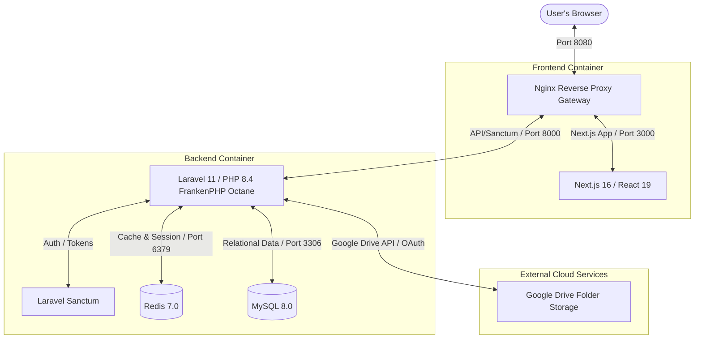

# BSCpE 2-1 OJT E-Portfolio — Project Map & System Architecture

This master mapping document provides a complete visual and structural representation of the E-Portfolio tracking application. It serves as the primary system map so developers and AI agents do not need to parse the entire codebase to understand file layouts, schemas, API endpoints, or workflows.

---

## 🗺️ System Architecture

The project is built as a fully containerized, microservices-style full-stack application orchestrated by Docker Compose:



### Routing Rules (Nginx proxy)
- `/api/*` and `/sanctum/*` $\rightarrow$ Laravel Backend container (`http://backend:8000`)
- `/*` (All other requests) $\rightarrow$ Next.js Frontend container (`http://frontend:3000`)

---

## 📂 Codebase File Map

### 1. Root Configuration Files
- [compose.yaml](file:///home/lloyd/project-bscpe2-1/BSCpE_2-1_OJT_Eportfolio/compose.yaml) — Docker orchestration for Nginx, Frontend, Backend, MySQL, and Redis.
- [AI_CONTEXT.md](file:///home/lloyd/project-bscpe2-1/BSCpE_2-1_OJT_Eportfolio/AI_CONTEXT.md) — Brief summary of recently merged custom features and active limitations.
- [README.md](file:///home/lloyd/project-bscpe2-1/BSCpE_2-1_OJT_Eportfolio/README.md) — Standard installation/bootstrap commands.

### 2. Backend Layout (`/backend`)
```text
backend/
├── app/
│   ├── Http/
│   │   ├── Controllers/Api/   # API Request Handlers
│   │   │   ├── AuthController.php          # Login, logout, profile update
│   │   │   ├── DocumentController.php      # Upload, pending list, review action, delete
│   │   │   ├── UserController.php          # CRUD, student details, checklist
│   │   │   ├── CompanyController.php       # Companies roster list and details
│   │   │   ├── BlockController.php         # Roster blocks/adviser information
│   │   │   ├── NotificationController.php  # User in-app notification endpoints
│   │   │   ├── GoogleOAuthController.php   # Google Drive Admin OAuth callbacks
│   │   │   └── AccountSetupController.php  # Student first-time passwords/setup
│   │   ├── Middleware/
│   │   │   └── EnsureUserHasRole.php       # Role-based route guard ('admin', 'prof', 'normal')
│   │   └── Requests/                       # Validation rule sets
│   │       ├── ChangePasswordRequest.php
│   │       ├── LoginRequest.php
│   │       ├── ReviewDocumentRequest.php
│   │       └── UploadDocumentRequest.php
│   ├── Models/                         # Eloquent Database Models
│   │   ├── User.php                        # Student/Staff profiles, relation to Company
│   │   ├── Document.php                    # OJT Document uploads, Google Drive IDs, Statuses
│   │   ├── Company.php                     # Partner companies, MOA statuses
│   │   ├── Block.php                       # Cohort blocks & assigned advisers
│   │   ├── Notification.php                # System alert entries
│   │   ├── GoogleOAuthToken.php            # Service-account / admin token store
│   │   └── AccountSetupToken.php           # One-time tokens for profile setups
│   └── Services/                       # Core Business Logic Layer
│       ├── GoogleDriveService.php          # Wrapper for Google API file creation/deletion
│       ├── DocumentService.php             # Review workflow & cumulative DTR calculations
│       └── AuthService.php                 # Token and profile logic
├── config/                             # App and service configuration arrays
├── database/
│   ├── migrations/                     # Database schema definitions
│   └── seeders/                        # Seed data (UserSeeder, CompanySeeder)
├── routes/
│   └── api.php                         # All backend routes mapped to API controllers
└── Dockerfile                          # FrankenPHP Base image setup running Octane
```

### 3. Frontend Layout (`/frontend`)
```text
frontend/
├── app/
│   ├── layout.tsx                      # Root page wrapper with Font definitions
│   ├── page.tsx                        # Public landing page (features, accordion)
│   ├── context/
│   │   └── RoleContext.tsx             # AuthContext provider (holds User role, tokens)
│   ├── lib/
│   │   └── config.ts                   # Static navigation definitions and constants
│   ├── components/                     # Reusable layout and interface parts
│   │   ├── AppNavbar.tsx               # Primary global responsive header
│   │   ├── ProtectedRoute.tsx          # Client-side routing guard based on Role
│   │   ├── DocumentReviewList.tsx      # Core list showing pending files for review
│   │   ├── DocumentViewerModal.tsx     # Lightbox for viewing PDFs from Google Drive
│   │   ├── AdminStudentPanel.tsx       # Slide-out details drawer for student reviews
│   │   └── Toast.tsx                   # System event alerts
│   ├── students/
│   │   └── page.tsx                    # Roster view (Grid of students with progress pills)
│   ├── admin/
│   │   ├── page.tsx                    # User Management grid (CRUD actions)
│   │   ├── checklist/                  # Matrix checklist showing document submission status
│   │   │   └── page.tsx
│   │   └── activity-log/
│   │       └── page.tsx                # Administration security trail list
│   ├── profile/
│   │   └── page.tsx                    # Student's Dashboard (Phase milestones, uploads)
│   ├── login/                          # Login gateway page
│   ├── setup-account/                  # Onboarding portal via custom code
│   ├── change-password/                # Force password change page
│   └── reset-password/                 # Standard password recovery page
├── lib/
│   └── api.ts                          # Wrapper for browser fetch() injecting Auth Bearer
└── Dockerfile                          # Node Next.js development environment image
```

---

## 🗄️ Database Schema & Relations

The application database schema is outlined below:

### 1. `users` Table
- `id` (bigint, PK)
- `name` (varchar)
- `email` (varchar, Unique)
- `password` (varchar)
- `role` (enum: `'normal'` [Student], `'prof'` [Professor], `'admin'` [Coordinator])
- `company_id` (foreign key $\rightarrow$ `companies.id`, nullable)
- `phone` (varchar, nullable)
- `program` (varchar, nullable)
- `ojt_role` (varchar, nullable)
- `ojt_supervisor` (varchar, nullable)
- `emergency_contact_name` (varchar, nullable)
- `emergency_contact_number` (varchar, nullable)
- `hours_rendered` (decimal 8,2, default: 0.00)
- `required_hours` (decimal 8,2, default: 0.00)
- `ojt_start_date` (date, nullable)
- `ojt_end_date` (date, nullable)
- `must_change_password` (boolean, default: true)
- `can_review` (boolean, default: false)
- `is_active` (boolean, default: true)
- `timestamps`

### 2. `companies` Table
- `id` (bigint, PK)
- `name` (varchar)
- `address` (varchar)
- `contact_person` (varchar, nullable)
- `contact_number` (varchar, nullable)
- `sector` (varchar, nullable)
- `has_moa` (boolean, default: false)
- `timestamps`

### 3. `documents` Table
- `id` (bigint, PK)
- `user_id` (foreign key $\rightarrow$ `users.id`)
- `document_type` (varchar) — e.g. `'resume'`, `'moa'`, `'dtr'`, etc.
- `week` (int, nullable) — associated weekly report/DTR index
- `submitted_date` (date, nullable)
- `claimed_hours` (decimal 8,2, nullable) — only populated for `'dtr'` document type
- `file_id` (varchar) — Google Drive File ID
- `file_link` (text) — Google Drive Web View Link
- `status` (enum: `'pending'`, `'approved'`, `'rejected'`)
- `reviewed_by` (foreign key $\rightarrow$ `users.id`, nullable)
- `reviewed_at` (datetime, nullable)
- `rejection_reason` (text, nullable)
- `timestamps`

### 4. `blocks` Table
- `id` (bigint, PK)
- `block_code` (varchar)
- `block_name` (varchar)
- `adviser_name` (varchar)
- `adviser_document_file_id` (varchar, nullable)
- `adviser_document_link` (text, nullable)
- `timestamps`

### 5. `notifications` Table
- `id` (bigint, PK)
- `user_id` (foreign key $\rightarrow$ `users.id`)
- `title` (varchar)
- `message` (text)
- `is_read` (boolean, default: false)
- `timestamps`

---

## 📡 API Endpoints Mappings

All API endpoints are prefixed with `/api` and defined in [backend/routes/api.php](file:///home/lloyd/project-bscpe2-1/BSCpE_2-1_OJT_Eportfolio/backend/routes/api.php):

| Method | Endpoint | Handler | Middleware | Description |
| :--- | :--- | :--- | :--- | :--- |
| **POST** | `/login` | `AuthController@login` | *Public* | Validates email/password and returns a Sanctum bearer token. |
| **POST** | `/logout` | `AuthController@logout` | `auth:sanctum` | Revokes the current token. |
| **GET** | `/me` | `AuthController@me` | `auth:sanctum` | Returns full authenticated user object. |
| **PATCH** | `/profile` | `AuthController@updateProfile` | `auth:sanctum` | Updates current user's contact information. |
| **POST** | `/change-password` | `AuthController@changePassword` | `auth:sanctum` | Forces password resets. |
| **GET** | `/companies` | `CompanyController@index` | *Public* | Fetches the full companies index. |
| **GET** | `/companies/{id}` | `CompanyController@show` | `auth:sanctum` | Details of a company and its assigned students. |
| **GET** | `/block` | `BlockController@show` | *Public* | Gets details of block & adviser metadata. |
| **POST** | `/setup-account` | `AccountSetupController@complete` | *Public* | Completes first-time user setup. |
| **POST** | `/forgot-password` | `PasswordResetController@request` | *Public* | Issues a password reset token. |
| **POST** | `/reset-password` | `PasswordResetController@complete` | *Public* | Changes a user password via reset token. |
| **GET** | `/google/callback` | `GoogleOAuthController@callback` | *Public* | Receives OAuth code from Google. |
| **GET** | `/google/auth` | `GoogleOAuthController@redirect` | `auth:sanctum` | Redirects to Google Consent Screen (Admin only). |
| **GET** | `/google/status` | `GoogleOAuthController@status` | `auth:sanctum` | Returns connection status to Google API. |
| **GET** | `/students` | `UserController@index` | `auth:sanctum` | Retrieves the student roster list. Renders conditional fields. |
| **POST** | `/documents/upload` | `DocumentController@upload` | `auth:sanctum` | Uploads file to Google Drive and creates record. |
| **GET** | `/documents/mine` | `DocumentController@mine` | `auth:sanctum` | Renders a student's own upload history. |
| **DELETE** | `/documents/{id}` | `DocumentController@destroy` | `auth:sanctum` | Deletes a document from Drive and DB (Owner/Admin). |
| **GET** | `/documents/pending` | `DocumentController@pending` | `role:admin,prof` | Returns list of all documents awaiting review. |
| **PATCH** | `/documents/{id}/review` | `DocumentController@review` | `role:admin,prof` | Approves/rejects a document, updates student hours. |
| **GET** | `/admin/checklist` | `UserController@checklist` | `role:admin,prof` | Matrix checklist data generation. |
| **GET** | `/admin/users` | `UserController@index` | `role:admin` | List of all users in system for CRUD. |
| **POST** | `/admin/users` | `UserController@store` | `role:admin` | Creates/invites a new user. |
| **DELETE** | `/admin/users/{id}` | `UserController@destroy` | `role:admin` | Removes a user completely. |
| **GET** | `/admin/users/{id}` | `UserController@show` | `role:admin,prof` | Fetch specific student details with document tree. |
| **GET** | `/admin/activity-logs` | `ActivityLogController@index` | `role:admin` | Returns administrative audit log trails. |

---

## 💻 Frontend Routing Map

All pages are built using **Next.js App Router**:

| Route Path | Physical File Location | Allowed Roles | Main Components Integrated | Purpose |
| :--- | :--- | :--- | :--- | :--- |
| `/` | [frontend/app/page.tsx](file:///home/lloyd/project-bscpe2-1/BSCpE_2-1_OJT_Eportfolio/frontend/app/page.tsx) | *All* | `HeroSection`, `AboutSection`, `SkillsSection`, `CompanySection`, `DocumentsSection` | Landing page outlining course features, partner companies and contacts. |
| `/login` | [frontend/app/login/page.tsx](file:///home/lloyd/project-bscpe2-1/BSCpE_2-1_OJT_Eportfolio/frontend/app/login/page.tsx) | *Unauthenticated* | Standard Form UI | Login gateway |
| `/setup-account`| [frontend/app/setup-account/page.tsx](file:///home/lloyd/project-bscpe2-1/BSCpE_2-1_OJT_Eportfolio/frontend/app/setup-account/page.tsx) | *All* | Registration Form | Onboarding portal via custom code |
| `/profile` | [frontend/app/profile/page.tsx](file:///home/lloyd/project-bscpe2-1/BSCpE_2-1_OJT_Eportfolio/frontend/app/profile/page.tsx) | `normal` (Student) | `HoursProgressCard`, `WeeklyMilestoneTracker`, `SubmissionHistoryTable`, `OjtDeploymentCard` | The student's dashboard to track OJT phases, hours rendering progress, and submit documents. |
| `/students` | [frontend/app/students/page.tsx](file:///home/lloyd/project-bscpe2-1/BSCpE_2-1_OJT_Eportfolio/frontend/app/students/page.tsx) | `normal`, `prof`, `admin` | `AdminStudentPanel`, `StudentPreviewModal` | Roster list. Students view their details; staff can click students to open `AdminStudentPanel` drawer. |
| `/prof/review` | [frontend/app/prof/review/page.tsx](file:///home/lloyd/project-bscpe2-1/BSCpE_2-1_OJT_Eportfolio/frontend/app/prof/review/page.tsx) | `prof`, `admin` | Full screen PDF viewer | Centralized review queue panel, showing a list of pending documents FIFO. |
| `/admin` | [frontend/app/admin/page.tsx](file:///home/lloyd/project-bscpe2-1/BSCpE_2-1_OJT_Eportfolio/frontend/app/admin/page.tsx) | `admin` | `ManageUsersSection` | Admin Dashboard: User invites, profile status switches, passwords resets. |
| `/admin/checklist`| [frontend/app/admin/checklist/page.tsx](file:///home/lloyd/project-bscpe2-1/BSCpE_2-1_OJT_Eportfolio/frontend/app/admin/checklist/page.tsx) | `prof`, `admin` | Matrix Table Layout | Displays matrix status (Approved/Pending/Rejected) for all 18 documents for all students. |
| `/admin/activity-log`| [frontend/app/admin/activity-log/page.tsx](file:///home/lloyd/project-bscpe2-1/BSCpE_2-1_OJT_Eportfolio/frontend/app/admin/activity-log/page.tsx) | `admin` | Log Grid UI | Administrative audit trail list |

---

## ⚡ Core Systems & Workflows

### 1. Document Upload & Google Drive Sync
When a student uploads a document on `/profile`:
1. The frontend hits `/api/documents/upload` using `multipart/form-data` containing the file object and its fields.
2. `DocumentService@uploadDocument` intercepts it.
3. If `document_type` is `'dtr'` and no `week` is provided, any prior pending DTR is automatically superseded (deleted) to prevent queue stuffing.
4. The service fetches the student's personal directory folder on Google Drive (`"email - name"`). If the folder doesn't exist, it creates one.
5. The file is uploaded directly to Google Drive via the `GoogleDriveService` client wrapper.
6. A record is written into the `documents` table, storing the file's ID, the link, the student's `claimed_hours` (if DTR), and the `'pending'` status.
7. In-app notifications are logged for all reviewing staff.

### 2. Review Workflow & Hours Accumulation
When a professor/coordinator reviews a document:
1. They access `/prof/review` (or open the slide-out `AdminStudentPanel` drawer in `/students`).
2. They click **Approve** or **Reject** (if rejecting, a reason is required).
3. The client calls `PATCH /api/documents/{id}/review` with `{ status: "approved" | "rejected", reason?: string }`.
4. `DocumentService@reviewDocument` handles database column updates.
5. **Hours accumulation logic (DTR only)**:
   - If the document is approved and is a `'dtr'` type, the system adds the `claimed_hours` to the student's `hours_rendered` field:
     `$document->user->hours_rendered + $document->claimed_hours`
6. An in-app notification is sent to the student stating the review decision.

> [!WARNING]
> **Known Architecture Discrepancy (Increment vs Absolute Total)**:
> In the frontend (`DocumentReviewList.tsx` and `AdminStudentPanel.tsx`), the interface displays a DTR approval as a transition setting the student's total hours to the new value (treating `claimed_hours` as an absolute total).
> However, on the backend (`DocumentService.php`), approvals are implemented as an increment: `hours_rendered + claimed_hours`.
> If extending DTR tracking, ensure this alignment mismatch is addressed (e.g. by storing individual weekly increments or resolving the calculation).

---

## 🛠️ Developer Checklist & Commands

### Backend Edits & FrankenPHP Memory Cache
Laravel FrankenPHP Octane keeps the backend application state cached in memory. **State will not reload when PHP files are edited.**
After editing any file in `/backend/app`, run:
```bash
docker compose exec backend php artisan octane:reload
```

### Resetting NextJS Cache
If frontend modifications do not seem to apply because of Next.js volumes:
```bash
docker compose stop frontend
docker compose rm -f -v frontend
docker compose up -d frontend
```

### Seeding Credentials
To seed local test accounts (from [UserSeeder.php](file:///home/lloyd/project-bscpe2-1/BSCpE_2-1_OJT_Eportfolio/backend/database/seeders/UserSeeder.php)):
1. Run migrations and seeders:
   ```bash
   docker compose exec backend php artisan migrate:fresh --seed
   ```
2. Log in using the default accounts:
   - **Student**: `student@ojt.dev` / `Student@2026`
   - **Professor**: `prof@ojt.dev` / `Prof@2026`
   - **Admin**: `admin@ojt.dev` / `Admin@2026`
